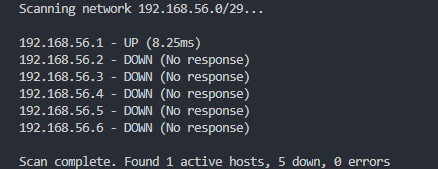
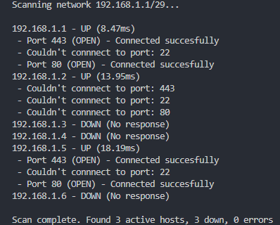

# Python IP & Port Scanner Script

This is a Python script that is designed to scan all the hosts within a specified network range with CIDR notation which will then determine whether a host inside the range is `UP`, `DOWN`, or if an `ERROR` occured
## How to run it

### IP scanner

If you only want to scan the hosts on a given network range and list basic information
- Make sure you have Python installed.
- Run it in the terminal by placing `python` or `python3` in front of the path of the file then place the network you want to scan with cidr notation of course (e.g. `python3 ip_scanner.py python ip_scanner.py 192.168.1.0/24`).
- In the event you need to run the script with elevated privileges on Linux/Mac use `sudo` at the beginning of the command `(sudo python3 ip_scanner.py)`.

### Port Scanner

Along with getting information on the host such as whether it's "UP" or "DOWN" you can get information on whether the hosts you are scanning are using the ports that you specify.

- To run the port scanner on your network range just follow the same steps as the regular IP scanner but add a `-p` at the end of your network range followed by the ports you want to scan seperated by a comma.

Example:
    
    python3 porthole.py 192.168.1.0/24 -p 443,20,80

## Dependencies 

- Python
- Linux system 
- Windows system

Modules (although they should all be pre-installed with Python):

- **ipaddress**: To validate and parse CIDR notation.
- **subprocess**: For executing shell commands inside Python.
- **sys**: To exit out of the script incase of any errors.
- **time**: Used to measure the responses times for the IP addresses.
- **argparse**: Handling command line input.

## Error handling

- If the end user puts in the wrong CIDR notation they will recieve an error telling them it isn't in the proper CIDR Notation.

- If the ping command encounters an issue it will reserve the host as an error and return the error message associated with it.

- Incase a host doesn't respond to the ping in a set amount of time a message will appear telling the end user that there was no response or the host is unreachable.

## Why?

The reason I made this script is because Python one of the most used programming languages and probably the most beginner friendly coding language , and it can even be used cross-platform in the event you need a script that's interchangable on both Linux and Windows systems.

## Example usage
**Regular IP address scan**

**IP scan with ports**

